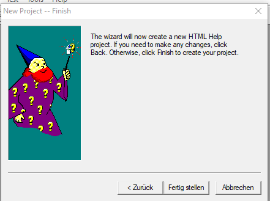

# PepsCommonDocGenerator
PEPS Common Doc (chm) Generator 

## 项目依赖

python 版本 3.7.9

需要依赖包：

- django
- six

## 准备阶段

### 1. 反编译/提取 CHM文件

#### 使用 HH 工具

使用hh.exe，hh.exe 是 Windows 中 CHM 文件的查看器。 它不仅可以显示 CHM 文件，还可以提取 CHM 文件。 我们打开命令提示符并切换到 CHM 文件的目录。

在这里，我们可以使用以下命令提取 CHM 文件：

```
Hh.exe -decompile output directory chmdatei.chm
```

#### 使用 7zip 压缩工具

7zip 也可以解压 CHM 文件。 只需右键单击该文件。


两种情况下的结果相似。


左边是hh.exe的导出，右边是7zip。 多出的是可用的其他文件和目录，它们不是内容。

### 2. 反编译后的文件解释

HH 工具反编译后的文件如下：

- .htm 网页文件。
- .css 网页样式文件。
- .js 网页JavaScript脚本文件。
- .brs 存储浏览序列文件 - 可以使用记事本打开。BRS 文件是 HTML Help 的二进制索引文件，通常与 GLO 文件相关联。 BRS 文件包含用于支持全局索引的二进制数据。这些文件在 CHM 文件中实现全局索引的快速搜索。
- .hhc 存储的是由Microsoft帮助内容/网站导航表 - 可以使用记事本打开。HHC 文件是 HTML Help 目录文件，用于定义 CHM 文件的目录结构。它包含了链接到 CHM 文件中各个 HTML 页面的信息，以及定义目录树的结构、节点、关键字等。HHC 文件负责组织和呈现帮助文档的目录。
- .hhk 它存储的是由Microsoft帮助的索引 - 可以使用记事本打开。HHK 文件是 HTML Help 索引文件，用于定义 CHM 文件的索引。索引允许用户通过**关键字搜索文档内容**。HHK 文件包含关键字及其对应的索引条目，通常包括相关页面的标题、文件路径等信息。
- .glo 存储词汇表 - 可以使用记事本打开，GLO 文件是 HTML Help 的全局索引文件。它包含了 CHM 文件的全局索引，允许用户通过关键字搜索文档内容。与 `hhk` 文件不同，GLO 文件提供了全局的索引，而不是针对某个特定的页面。它通常包含各种关键字及其对应的索引条目。
- .ing 非重要文件。 

#### Help Document 所有相关文件解释如下：

- .ali - Alias file - Used with Context Sensitive help - Can be opened with Notepad
- .BRS - Stores Browse Sequences - Can be opened with Notepad
- .cpd - Cache Project Database - Can be opened with Microsoft Access
- .glo - Stores Glossary - Can be opened with Notepad
- .hhc - Stores TOC - Can be opened with Notepad
- .hhk - Stores Index - Can be opened with Notepad
- **.hhp - HTML Help (.CHM) project file - Can be opened with Notepad**
- .ign - Stores Ignore list - Can be opened with Notepad
- .ldb - Lock Database file used with .CPD
- .phr - Stores Phrase List - Can be opened with Notepad
- .ppf - Stores ancillary project information - Can be opened with Notepad
- .pss - Stores ancillary project information - Can be opened with Notepad
- .stp - Stores Stop List - Can be opened with Notepad
- .syn - Stores Synonym List - Can be opened with Notepad
- .xpj - Main Project Datatbase file with XML data - Can be opened with Notepad

### 3. 恢复hhp文件

`.hhp`， 是Help Document的项目主文件，包含了项目所有设置信息，需要注意的是，反向编译后并不会生成该文件，需要自己手动添加。

添加方法，打开HTML Help Workshop，选择菜单`File`, 然后选择`New`，接下来如下图所示选择`Project`，点击`OK`，


然后在新的窗口，如下图所示，点击下一步`Next(Weiter)`，


新出现的窗口中，提示需要指明文件名称，文件名称可以于反编译的hhk文件一致，并保存至相同的目录中，如下图所示，点击下一步`Next(Weiter)`，


由于是反编译，`.hhc`文件，`hhk`文件，以及`.htm`都已经存在，所以需要在新的窗口中要勾选3个选项，如下图所示，点击下一步`Next(Weiter)`，


在新出现的对话框中选择`.hhc`文件路径，如下图所示，点击下一步`Next(Weiter)`，


在新出现的对话框中选择`.hhk` 文件路径，如下图所示，点击下一步`Next(Weiter)`，


在新出现的对话框中选择需要包括的`.htm` 文件路径，如下图所示，点击下一步`Next(Weiter)`，


在新出现的对话框点击`OK(Fertig stellen)`完成项目配置的恢复。



此时源文件目录中就会生成一个`.hhp`文件。在重新生成新的`hhp`文件时，需要注意目标语言设置；引用路径；编译结果路径设置等，例如简体中文的文件输出如下，

```ini
[OPTIONS]
Auto Index=Yes
Compatibility=1.1 or later
Compiled file=..\output\Turn_086.chm
Contents file=Turn_086.hhc
Default Font=,8,134
Default topic=_()Button.htm
Display compile progress=No
Full-text search=Yes
Index file=Turn_086.hhk
Language=0x804 Chinesisch (vereinfacht, China)

...
```


### 4. 将Help Document的相关文件放置在source/asset文件夹

项目原始语言为英语，文件后缀为_044，未来其它语言版本的相关文件可以使用其它代码后缀并保存在该文件目录中，路径如下图所示。


记得将文件重名名为Wire_xxx.brs等，文件需要从cp1252转码至utf-8保存。然后使用工具修复brs和hhp文件中的路径，主要是将路径中的德语符号和其它特殊符号进行进行转换。

可使用如下命令进行BRS文件修复，

```bash
python executor.py fix brs
```

可使用如下命令进行HHP文件修复，

```
python executor.py fix hhp
```

还需要注意修改hhp文件的OPTION选项，参考如下内容，如果已经在上一步完成修改，则可转至下一步。

```ini
[OPTIONS]
Auto Index=Yes
Compatibility=1.1 or later
Compiled file=..\output\Turn_086.chm
Contents file=Turn_086.hhc
Default Font=,8,134
Default topic=_()Button.htm
Display compile progress=No
Full-text search=Yes
Index file=Turn_086.hhk
Language=0x804 Chinesisch (vereinfacht, China)
```

### 5. 在source 目录内生成django应用

首选要初始化项目，在source文件中使用下列命令生成一个名为myapp的Django应用，

```powershell
C:\Users\wang\.pyenv\pyenv-win\versions\3.7.9\Scripts\django-admin.exe startapp myapp
```

然后将extra文件夹中的`manage.py`文件拷贝在source文件夹中。

注意：这里和Django的默认流程稍有不同。

然后将extra文件夹中的`settings.py`, `urls.py`, `views.py` 和 `wsgi.py` 四个文件复制到myapp文件夹内。

备注：*上述内容可以通过另一种方式实现，可以现在根目录下，使用django-admin startproject myapp生成一个名为myapp的新项目*，然后将顶层myapp文件夹重名名为source，即可。

### 6. 尝试启动django 网页服务

使用下述命令启动网页服务，测试项目配置：

```powershell
python manage.py  runserver
```

第一次启动时，会出现如下提示：

```powershell
You have 18 unapplied migration(s). Your project may not work properly until you apply the migrations for app(s): admin, auth, contenttypes, sessions.
....

System check identified no issues (0 silenced).

You have 18 unapplied migration(s). Your project may not work properly until you apply the migrations for app(s): admin, auth, contenttypes, sessions.
Run 'python manage.py migrate' to apply them.
```

运行提示命令，如下：

```powershell
python manage.py migrate
```

上述命令主要完成**后台管理**，**登录认证管理**，`contenttypes`和**会话**相关的配置。

`contenttypes`框架，它可以跟踪Django项目中安装的所有模型（model），为我们提供更高级的模型接口。

### 7. 在source中添加一个templates和static文件夹

**templates** 即为模板文件夹，需要将反编译chm后的非项目文件中的htm文件，可以试用source文件夹中的executor.py 文件，将所有的htm原始文件将从orgin文件夹收集到templates文件夹。

```
executor.py collect htm
```

**static** 即为静态文件夹，需要将反编译chm后的非项目文件中的css, jpg和 js文件，文件拷贝在这个目录中。

上述动作可以使用extra中的相关batch文件：

- xcopy-origin-static-all.bat
- xcopy-origin-templates-all.bat

在使用上述batch文件的时候，注意忽略文件夹。

可以试用source文件夹中的executor.py文件，将所有静态文件将从orgin文件夹收集到static文件夹。 

```
executor.py collect static all
```

### 8. extra文件夹中的子文件夹templatetags

将extra文件夹中的子文件夹templatetags拷贝在myapp中，其主要是美化生成的htm模板格式

### 9. extra文件夹中的base.html

extra文件夹中的base.html拷贝至templates文件夹作为基础模板。

### 10. 修改template中的htm文件

开始逐个修改tempaltes文件夹中的htm文件，主要内容包括：

1. 处理htm编码问题

    ```
    executor.py transcode full .
    ```

2. 检查htm文件名，通常之前的`python executor.py fix brs` 会修复文件名，通过重复名的方式。该步主要为了检查文件名。

    ```
    python executor.py fixname full .
    ```

3. 引入base.html，main.html与menuitem.html模板文件，从extra拷贝至source目录。

4. 将`&uuml;`替换成`ue`, 该部分字符会出现在href的属性值中，，可以通过如下命令实现第4步的内容，

   ```
   python executor.py fixinnerhref full
   ```

5. 检查`<p>&#160</p>;`字符，并将其替换成`<br>`

6. 替换所以的`<font>` 和`</font>` ，将其替换成''[" 和 "]"

7. 替换所以的`<a>` 和`</a>` ，将其替换成''#" 和 "#", 同时将相关数据保存在h2t文件中，已被以后替换使用。

8. 设置翻译标识

9. 翻译需要保证''["， "]"和"#"字符不得丢失，可以通过如下命令实现第5至9步的内容，新版本中，

    ```
    python executor.py convert full .
    ```

- 收集翻译后，渲染模版之前要重新将两种字符替换回来。

从CHM文件中提取的htm文件一般都是使用windows-1252编码格式进行编码的，所以需要对这些文件进行预处理，可以使用工具`executor.py transcode`来完成编码转化。如果htm文件名包含特殊的西语字符，则需要修复文件名，同时修复文件内href引用。

注意：**新的模型下，htm的body部分已经不在翻译，将使用selenium与google翻译结合，自动完成页面内容的翻译。需要用到translator.py，当然未来代码可能合并到executor.py中。**

## 进阶阶段

### 1. 修改设置文件settings.py 确保Django实现国际化

该项目中我们使用django的相关模块i18n，来完成页面的国际化，为此需要对settings.py文件进行相应的适配，主要修改的内容如下:

```
MIDDLEWARE_CLASSES = (
    ...
    'django.middleware.locale.LocaleMiddleware',
)
 
 
LANGUAGE_CODE = 'en'
TIME_ZONE = 'UTC'
USE_I18N = True
USE_L10N = True
USE_TZ = True
 
LANGUAGES = (
    ('en', ('English')),
    ('zh-cn', ('中文简体')),
    ('zh-tw', ('中文繁體')),
)
 
#翻译文件所在目录，需要手工创建
LOCALE_PATHS = (
    os.path.join(BASE_DIR, 'locale'),
)
 
TEMPLATE_CONTEXT_PROCESSORS = (
    ...
    "django.core.context_processors.i18n",
)
```

**注意：Django 1.9 及以上版本中，语言的代码发生变化(详情链接：[github](https://github.com/django/django/commit/e5e044da87800feb6ef63fef1765d8c05022d926), [django ticket](https://code.djangoproject.com/ticket/18419)，如下**

```
LANGUAGES = (
    ('en', ('English')),
    ('zh-hans', ('中文简体')),
    ('zh-hant', ('中文繁體')),
)
```

### 2. 收集翻译标识，生成需要翻译的文件

生成需要翻译的文件（Django 1.8及以下的版本）：

```
python manage.py makemessages -l zh-cn
python manage.py makemessages -l zh-tw
```

Django 1.9 及以上版本要改成

```
python manage.py makemessages -l zh_hans
python manage.py makemessages -l zh_hant
```

我们使用上述命令的扩展功能，具体命令如下：

```
python manage.py makemessages -l zh_hans --extension=html,htm,brs,hhc,hhk,xml
python manage.py makemessages -l zh_hant --extension=html,htm --extension xml
```

参数：

​	--extension， 收集的翻译标识的文件后缀

 注意德语是de_DE, 英文en_US.

### 3. 手工翻译locale文件夹中的 django.po

假如locale文件夹中相应的语言标识的子文件夹中的`.po`文件如下，

```
...
 
 
#: .\tutorial\models.py:23
msgid "created at"
msgstr "创建于"
 
#: .\tutorial\models.py:24
msgid "updated at"
msgstr "更新于"
 
...

```

#### HTM 文件翻译

为了提高翻译速率，针对于`htm`格式的模板，如果使用Visual Studio Code开发项目，则可以使用如下的`查找/替换`配置，实现相关翻译字符适配的半自动化，


查找的通配符：

```
([^>\]+)(?=</)
```

或者升级版本：

```
([^>]+)(?<!\s)(?=</)
```

或第二次升级版本

```
([^>[]+)[a-z.:]((?=<)|(?= <))
```

或

```
((?<=> )|(?<=>))[a-z.\s]+[a-z.\s(?<=\().+?(?=\))]+((?=<)|(?= <))
```

或

```
((?<=> )|(?<=>))[a-z.\s]+[a-z.\s]+((?=<)|(?= <))
```


替换的通配符

```

```

**注意：最新的翻译思路是，启动main.html然后用chrome自带的google翻译万能页面主内容的翻译，在chrome开发工具中，获得body内容。替换模板的body，以减少需要i18n翻译的内容。**

#### HHK 文件翻译

要实现自动化翻译，需要对hhk文件进行部分修改，主要是引入i18n翻译与缩进问题，文件修改完如下所示，

```html


<html>
<!-- Sitemap 1.0 -->
<object type="text/site properties">
  <param name="Image Width" value="16">
  <param name="Window Styles" value="0x800027">
  <param name="ExWindow Styles" value="0x100">
</object>

...
</html>

```


为了提高翻译速率，针对于`hhk`格式的模板(hhk本质上是一个xml文件)，如果使用Visual Studio Code开发项目，则可以使用如下的`查找/替换`配置，实现相关翻译字符适配的半自动化，

查找的通配符：

```
(?<=name="Name" value=")[A-Za-zÄÖÜäöüß():0-9_,;&\s\.\-\/]+(?=">)
```

替换的通配符

```

```

#### HHC 文件翻译

要实现自动化翻译，需要对hhc文件进行部分修改，主要是引入i18n翻译与缩进问题，文件修改完如下所示，

```html


<html>
<!-- Sitemap 1.0 -->
<object type="text/site properties">
  <param name="Image Width" value="16">
  <param name="Window Styles" value="0x800027">
  <param name="ExWindow Styles" value="0x100">
</object>

...
</html>

```


为了提高翻译速率，针对于`hhc`格式的模板(hhc本质上也是一个html文件)，如果使用Visual Studio Code开发项目，则可以使用如下的`查找/替换`配置，实现相关翻译字符适配的半自动化，

查找的通配符：

```
(?<=name="Name" value=")[A-Za-zÄÖÜäöüß():0-9_,;&\s\.\-\/]+(?=">)
```

替换的通配符

```

```

#### BRS 文件翻译

要实现自动化翻译，需要对brs文件进行部分修改，主要是引入i18n翻译，文件修改完如下所示，

```

[HELP14]
...
```


为了提高翻译速率，针对于`brs`格式的模板(brs 可以理解为一个txt文档)，如果使用Visual Studio Code开发项目，则可以使用如下的`查找/替换`配置，实现相关翻译字符适配的半自动化，

查找的通配符：

```
[A-Za-z0-9_,;&\s\S\.\-\/]+(?=\|)
```

替换的通配符

```

```

为了提高翻译速率，针对于`lng`格式的模板(lng 可以理解为一个ini文档)，如果使用Visual Studio Code开发项目，则可以使用如下的`查找/替换`配置，实现相关翻译字符适配的半自动化，

查找的通配符：

```
(?<==)[A-Za-z0-9_,;:&\s\.\-\/]+
```

替换的通配符

```

```


### 4. 编译 django.po 语言文件

我们使用如下命令，仅编译其中一种语言`zh_hans`，即简体中文的po文件。

```powershell
python manage.py compilemessages --locale zh_hans 
```

### 5.  测试翻译

测试时需要修改settings.py文件夹中内容，具体如下，

```python
LANGUAGE_CODE = 'zh-hans'
```


## 问题与解决方案

#### 1. django 3.0 中无法加载allow_lazy的问题

原始linebreakless标识的代码如下：

```
import six
from django import template
from django.template.base import Node
try:
    from django.utils.functional import allow_lazy
except ImportError as se:
    from django.utils.functional import allow_lazy


register = template.Library()


@register.tag
def linebreakless(parser, token):  # @UnusedVariable
    nodelist = parser.parse(('endlinebreakless',))
    parser.delete_first_token()
    return LinebreaklessNode(nodelist)


class LinebreaklessNode(Node):
    def __init__(self, nodelist):
        self.nodelist = nodelist

    def render(self, context):
        def lazy_function(strInput):
            strInput = strInput.replace("\n\n", "\n")
            return "\n".join(filter(lambda x: not x.isspace(), strInput.split("\n")))
        strip_line_breaks = allow_lazy(lazy_function, six.text_type)
        return strip_line_breaks(self.nodelist.render(context).strip())

```

在django 3.0之后，上述代码中的from django.utils.functional import allow_lazy会引发错误，解决方案可以使用keep_lazy代替allow_lazy， 完善代码如下。

```
import six
from django import template
from django.template.base import Node
try:
    from django.utils.functional import keep_lazy
except ImportError:
    from django.core.urlresolvers import reverse
    from django.utils.functional import lazy
    keep_lazy = lambda *args, **kwargs: lazy(reverse, str)(*args, **kwargs)

register = template.Library()

@register.tag
def linebreakless(parser, token):
    nodelist = parser.parse(('endlinebreakless',))
    parser.delete_first_token()
    return LinebreaklessNode(nodelist)

class LinebreaklessNode(Node):
    def __init__(self, nodelist):
        self.nodelist = nodelist

    def render(self, context):
        strip_line_breaks = keep_lazy(six.text_type)(
            lambda x: x.replace('\n\n', '\n'))

        return strip_line_breaks(self.nodelist.render(context).strip())

```

#### 2. 制作模板时需要替换的字符

下列字符

```
�checked�
```

替换成

```
'checked'
```

下列字符

```
�point and click�
```

替换成

```
'point and click'
```

#### 3. 关于中文编码问题

对于不同语言的设置。

Japanese: use shift-jis (cp932)
Chinese Traditional: Big5 (cp950)
Chinese Simplified: GB2312 (cp936)

 对于HTMLs的可以试用UTF-8编码
(using also the meta:
<meta http-equiv="Content-Type" content="text/html; charset=utf-8">)
但是对于 .hhk、hhc、hhp，您需要使用正确的编码。


#### 4. 关于特殊字符`&#160;`

特殊的空格-ASCII码值160，平时我们用键盘输入的空格的ASCII值是32，而这个ASCII值为160的空格，其实是不间断空格(non-breaking space)，是不是从来没听说过这东东？其实你平时一定也用过很多次的，就是页面上的&nbsp;所产生的空格。不间断空格non-breaking space的缩写正是`nbsp;`。

其带来的问题是，，就是它无法被trim()所裁剪，也无法被正则表达式的`\s`所匹配，也无法被StringUtils的isBlank()所识别，也就是说，无法像裁剪寻常空格那样移除这个不间断空格。

我们可以利用不间断空格的Unicode编码来移除它，其编码为`\u00A0`。

#### 5. 关于特殊字符`\xc6`

该字符 utf8编号u-00c6，使用`&#9824;`格式

#### 6. 关于特殊字符`\u2014`

该字符为连接符，可以用减号符号来替换

#### 7. 关于特殊字符`\xbf`

在渲染模板时会遇见，主要是翻译的文本的字符有错误。模板里面应该有类似这样`¿`的字符存在。使用`&00bf;`替换。